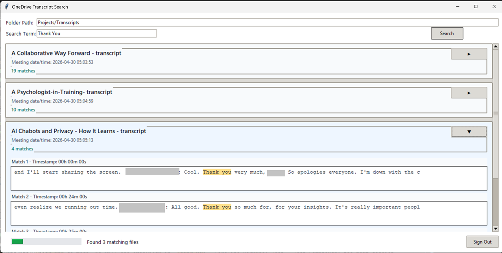

# OneDrive Transcript Search

Desktop application that searches Microsoft OneDrive transcript files for exact phrase matches and shows timestamped snippets in a clean, searchable UI.

## Screenshot



## Purpose

This project was built to make meeting transcript review faster and more practical.

- Search all transcript files in a target OneDrive folder from a single desktop app.
- Find exact multi-word phrases (case-insensitive) and view contextual snippets.
- Surface the nearest timestamp for each match to speed up review.
- Package the tool as a Windows desktop executable for non-technical users.

## Project Description

OneDrive Transcript Search is a Python/Tkinter desktop app that authenticates with Microsoft using device code login, lists files in a OneDrive folder via Microsoft Graph, extracts text from `.docx` transcripts, and returns matching results in an expandable card-based interface.

The app supports:

- Cached sign-in (MSAL token cache)
- Persistent folder path between runs
- Phrase matching across transcript text
- Timestamp-aware snippets
- Packaged distribution using PyInstaller

## Tech Stack

- Python 3.11
- Tkinter (desktop UI)
- MSAL (Microsoft authentication)
- Microsoft Graph API (OneDrive file listing/download)
- Requests (HTTP)
- python-dotenv (optional env config)
- PyInstaller (desktop build packaging)

## Setup (Development)

### 1. Prerequisites

- Windows machine
- Python 3.11 installed
- Microsoft account with OneDrive access
- Transcript files stored as `.docx` in a OneDrive folder

### 2. Clone and open

```powershell
git clone <your-repo-url>
cd SearchTool
```

### 3. Create and activate a virtual environment

```powershell
py -3.11 -m venv .venv
.\.venv\Scripts\Activate.ps1
```

### 4. Install dependencies

```powershell
python -m pip install --upgrade pip
python -m pip install msal python-dotenv requests pyinstaller
```

### 5. Optional environment configuration

Create a `.env` file in the project root if you want to override defaults:

```env
CLIENT_ID=<your-app-client-id>
TENANT_ID=consumers
```

To get `CLIENT_ID` from Azure:

1. Sign in to the Azure portal at <https://portal.azure.com>.
2. Go to **Microsoft Entra ID** -> **App registrations** -> **New registration**.
3. Enter an app name (for example, `OneDriveTranscriptSearch`) and keep account type as **Accounts in any organizational directory and personal Microsoft accounts**.
4. Create the app, then open the app's **Overview** page.
5. Copy the **Application (client) ID** value and paste it into `.env` as `CLIENT_ID`.
6. In **Authentication**, add platform **Mobile and desktop applications** and enable the default redirect URI for public clients if it is not already enabled.
7. In **API permissions**, ensure Microsoft Graph delegated permissions include `Files.Read` and `User.Read`, then grant consent if your tenant requires it.

Notes:

- `CLIENT_ID` defaults to a built-in public client if not provided.
- `TENANT_ID` defaults to `consumers` for personal Microsoft accounts.

### 6. Run the app

```powershell
python main.py
```

## Build a Desktop Application

This repository includes a PowerShell build script that creates a packaged Windows app with PyInstaller.

### Standard folder-based build

```powershell
./build.ps1
```

Output executable:

- `dist\OneDriveSearch\OneDriveSearch.exe`

### Single-file build

```powershell
./build.ps1 -OneFile
```

Output executable:

- `dist\OneDriveSearch.exe`

### Custom output directory (optional)

```powershell
./build.ps1 -DistPath dist-client
```

## Brief Architecture

The app follows a small modular architecture with clear responsibilities:

- `main.py`
  - Application entry point.
- `searchtool/app.py`
  - Tkinter UI, user interactions, background threading, and result rendering.
- `searchtool/cache_manager.py`
  - MSAL token cache lifecycle and folder path persistence.
- `searchtool/config.py`
  - Environment/config loading (`CLIENT_ID`, `TENANT_ID`, scopes, cache path).
- `searchtool/search_service.py`
  - OneDrive Graph calls, `.docx` text extraction, phrase search, and result shaping.
- `searchtool/ui_helpers.py`
  - Device login popup and queued UI messaging helpers.

High-level flow:

1. User enters OneDrive folder path + search phrase in the UI.
2. App acquires token with MSAL (cache-first, device-code fallback).
3. Graph API lists folder files and downloads `.docx` content.
4. Service extracts text and finds phrase matches + nearest timestamps.
5. UI renders grouped, expandable match cards.

## Authentication and Data Notes

- Sign-in uses Microsoft device code flow.
- Token cache is saved in local app data under `OneDriveSearch`.
- Searches are performed against files in the selected OneDrive folder using Microsoft Graph.

## Roadmap Ideas

- Export search results to CSV/JSON.
- Recursive subfolder search support.
- Highlight options (exact phrase vs. tokenized matching modes).
- File-type expansion beyond `.docx` transcripts.

---

This project is published as a portfolio showcase of practical desktop automation, Microsoft Graph integration, and user-focused search UX.